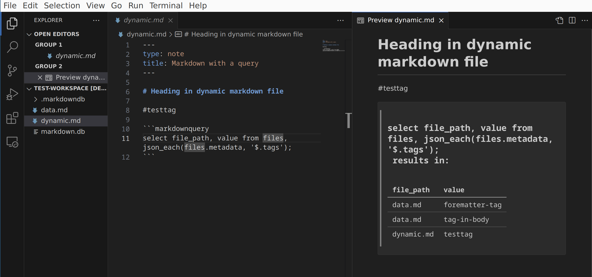

# markdown-queries README

This is the repository for the markdown-queries extension which adds dynamic query support for markdown previews. This extension is heavily influenced by [Obsidian Dataview](https://github.com/blacksmithgu/obsidian-dataview)



## Features

This is more POC at this point, but it is possible to put a sql query against a specific sqlite database created by [MarkdownDB](https://github.com/datopian/markdowndb)

There is a test workspace that you can open with the extension in debug mode after running 

```npm run prep-test-workspace```

If you open the workspace in src/test/test-workspace and open dynamic.md you should see the results of a query against the markdown files in the repo. 

The upshot is that you can do sql queries against against your markdown files including frontmatter attributes, tags, todos, etc.

## How it works

The extension declares that it extends the markdown-it processor in the standard markdown extension.

It provides a highlighter plugin to the markdown parser that calls a service object to run queries on the sql.js database that is loaded into memory on initialization from the markdown.db file in the workspace.

This is different from a preview script which runs in a webview without access to the rest of the vscode API.


## Future

This extension has a lot of potential but there is plenty of work to do to make this useful to anyone.

High level items that need dealing with:

- Indexing - this currently relies on the DB being there already. It will take some work to figure out how to get MarkdownDB to run inside of vscode and use sql.js and sync the DB to disk. (I looked into using sqlite but native modules in vscode have a lot of issues [Native node modules from extensions](https://github.com/microsoft/vscode/issues/658))

- Query language - Using SQL directly will be pretty awkward for most cases. At the same time, I don't want to write a custom query system. My current thought is to do some transparent macros to deal with common joins or accessing json metadata.

- Formatting - It would be nice to have some options for more flexible formatting of results for things like group_by and of course making todos and such look nice. This might require figuring out the split between the markdown-it plugin and preview scripts.

- Integration with [Foam](https://github.com/foambubble/foam) - This extension comes out of my desire to get more out of my knowledgebase, but at the moment it doesn't seem necessary to tie the two together yet.

- Security - Running arbitrary sql from user input? https://xkcd.com/327/

